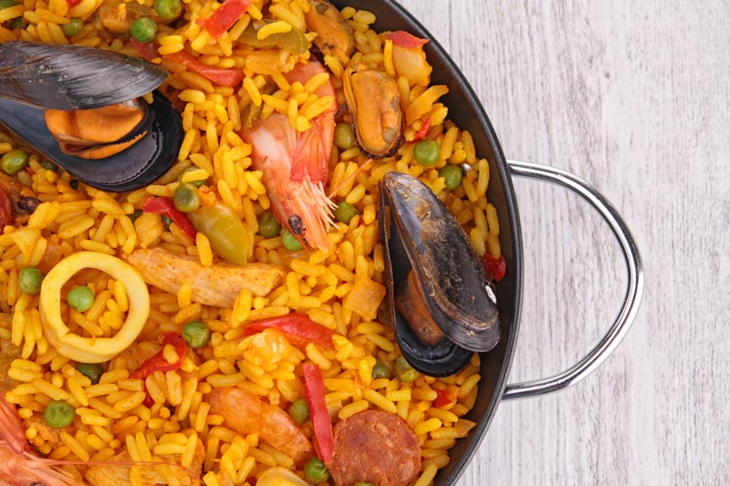

# MyFirstRepo

Tarea: Descargar el repositorio y escribir su receta favorita

## Receta de paella de mariscos

### Ingredientes

- 1 morrón rojo
- 1 morrón verde  
- 2 cebollas 
- Arroz doble carolina 200 gr
- 1 cda. pimentón dulce
- 2 ajos
- Azafrán o condimento para arroz.
- 500 grs. de calamar
- 200 grs. de mejillones
- 400 grs. de langostinos
- 200 grs. de almejas
- 200 grs. de berberechos
- 700 ml. de caldo de verduras

### Cómo hacer paella de mariscos paso a paso

Las proporciones dependen mucho del fuego y de lo grande que sea la paella. La que nunca falla es la de añadir tres veces el volumen de agua que lo que usaremos de arroz.

1. Lavar muy bien todos los frutos de mar y reservarlos. De ser necesario cepillar las almejas. Quitarle la piel a los calamares y cortarlo en rebanadas.
2. En aceite de oliva sofreír los langostinos por 5 minutos y reservar.
3. Luego sofreír los calamares por 5 minutos más. Ahora agregamos la cebolla, el ajo, pimiento y tomate picados en cuadritos pequeños, agregar sal y cocinar por 8 minutos a fuego bajo
4. Tras el sofrito, añadir el arroz y distribuir homogéneamente por la paellera. En este momento echamos el azafrán o condimento para arroz junto con el caldo. 
5. Dejamos que se cocine sin remover durante 25 o 30 minutos.
6. Pasados 10 minutos agregamos una cucharada de pimentón dulce, si le falta agregamos más agua.
7. Agregar las almejas y cocinar por 5 minutos para que se abran. Las que queden cerradas hay que desecharlas! Por último agregar los mejillones y los berberechos. Dejar cocinar 10 minutos más a fuego mínimo.
8. Agregar los langostinos y cocinar 5 minutos más.
9. Dejaremos reposar la paella unos minutos tapada con un gran paño antes de servirla. 
10. Preparen la mesa y disfruten esta paella de mariscos que es una delicia.

Publicado por Paulina Cocina - marzo 31 ,2022

